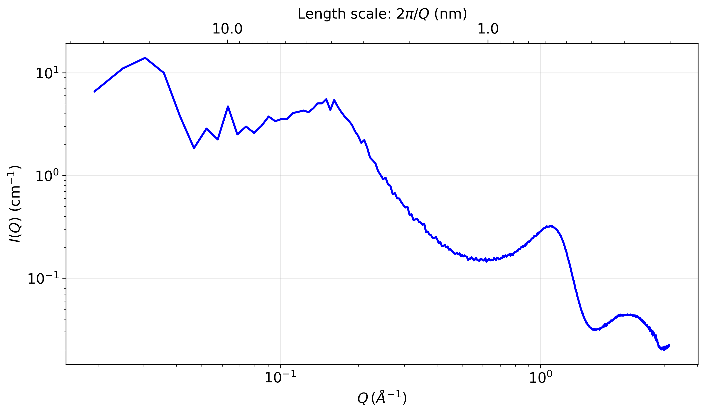

# CG-to-SAXS



This code reads LAMMPS dump trajectories from coarse-grained simulations and generates Small-Angle X-ray Scattering (SAXS) intensity profiles. It uses bead electron count and Fast Fourier Transforms (FFT) to compute structure factors and scattering intensities.

## Features

- **Multiple Density Assignment Methods**: Choose from several optimized algorithms for mapping coarse-grained beads to electron density grids
- **High Performance**: Optimized implementations with chunked processing and memory management for large systems
- **Flexible Input**: Supports LAMMPS dump trajectories with multiple atom types
- **Comprehensive Output**: Generates both numerical data (.npz) and publication-ready plots (.png)
- **Memory Efficient**: Handles large systems through intelligent memory management and optional restart functionality

## Quick Start

### Requirements

- Python 3.6+
- NumPy
- Matplotlib
- zstandard (for compressed file support)
- LAMMPS dump trajectory (example: `dump trj all custom 100000 trj.lammpsdump id mol type x y z ix iy iz`)

### Installation

```bash
git clone <repository-url>
cd cg-to-saxs-1
pip install numpy matplotlib zstandard
```

### Basic Usage

Run the example with the provided trajectory file:

```bash
python intensity_profile_gen.py example/trj.lammpsdump
```

This will:
1. Read the LAMMPS trajectory file `example/trj.lammpsdump`
2. Calculate SAXS intensity using the default density method
3. Generate output files:
   - `example/trj.i_q_dummy_in_cell.npz` - Numerical results (q values and intensities)
   - `example/trj.i_q_dummy_in_cell.png` - Publication-ready plot

## Density Assignment Methods

The code provides several methods for assigning coarse-grained beads to electron density grids:

| Method | Description | Best For | Performance |
|--------|-------------|----------|-------------|
| `dummy_in_cell` | Random sampling within spherical volumes | General use, good accuracy | Fast, memory efficient |
| `voxelization` | Sphere surface sampling | High accuracy representations | Very fast, optimized |
| `gaussian_in_cell` | Gaussian density distributions | Smooth density profiles | Fast with kernel precomputation |
| `cic` | Cloud-in-Cell interpolation | Legacy compatibility | Standard |
| `default` | Simple nearest-grid assignment | Quick approximations | Fastest |

## Configuration

### Script Parameters

Edit the parameters in `intensity_profile_gen.py`:

```python
# Scattering calculation parameters
q_max = 4                    # Maximum q value (1/Å)
dq = 0.007                   # q-resolution for output histogram
density_method = "dummy_in_cell"  # Choose density assignment method

# Computational parameters  
restart = True               # Use cached data if available
skip_every_ts = 1           # Process every nth timestep

# System parameters
typestodo = np.array([1, 2, 3, 4, 5, 6])  # Atom types to include
```

### Bead Properties

Configure electron counts and radii for each bead type in `workers.py`:

```python
# Electron counts per bead type (customize for your system)
type_weight = np.array([
    (16+3*8),      # Type 1: S + 3O atoms = 40 electrons
    (2*6+3*9+8),   # Type 2: 2C + 3F + O atoms = 47 electrons  
    (2*6+4*9),     # Type 3: 2C + 4F atoms = 48 electrons
    (2*6+4*9),     # Type 4: 2C + 4F atoms = 48 electrons
    (3*8+7*1),     # Type 5: 3O + 7H atoms = 31 electrons
    (3*8+6*1)      # Type 6: 3O + 6H atoms = 30 electrons
]).astype(np.int32)

# Bead radii in Angstroms (customize for your system)
type_radius = np.array([0.361, 0.400, 0.385, 0.385, 0.381, 0.381]) * rc

# Conversion factor from reduced units to Angstroms
rc = 6.589  # Adjust if using different unit system
```

**Important**: Modify these arrays to match your specific coarse-grained model:
- `type_weight`: Total electron count for each bead type
- `type_radius`: Effective spherical radius for each bead type
- Array indices correspond to LAMMPS atom types (starting from type 1)

## Advanced Usage

### Custom Trajectory Files

```bash
python intensity_profile_gen.py your_trajectory.lammpsdump
```

### Different Density Methods

Modify the `density_method` parameter in the script:

```python
density_method = "gaussian_in_cell"  # For smooth Gaussian profiles
density_method = "voxelization"      # For high-accuracy sphere sampling
```

### Memory Optimization

For large systems, the code automatically uses chunked processing. You can monitor memory usage and adjust system size as needed.

## Output Files

The script generates several output files:

- **`.npz` files**: NumPy archives containing:
  - `trj.npz`: the trajectory in Numpy format, for fast restart
  - `trj.i_q.npz`
    - `q_values`: Scattering vector magnitudes (1/Å)
    - `intensity`: Calculated SAXS intensities
  
- **`.png` files**: High-resolution plots showing:
  - Log-log plot of intensity vs. q
  - Secondary axis with length scales (2π/q)
  - Professional formatting for publications

## Performance Notes

- **Memory Usage**: The code uses FFT which can require significant RAM for large systems
- **Optimization**: Includes optimized algorithms with kernel precomputation and chunked processing
- **Scaling**: Handles systems from hundreds to thousands of beads efficiently
- **Restart**: Use `restart=True` to cache the trajectory reading step

## Example System

The included `example/trj.lammpsdump` file contains a sample coarse-grained trajectory that demonstrates the code's capabilities. This trajectory includes multiple bead types with different electron counts and radii.

The `example/` folder also contains pre-generated output files showing results from different density methods:
- `trj.i_q_voxelization.png` - High-accuracy sphere sampling results
- `trj.i_q_gaussian_in_cell.png` - Smooth Gaussian density profiles  
- `trj.i_q_dummy_in_cell.png` - Random sampling results
- And corresponding `.npz` data files

## Troubleshooting

### Memory Issues
- Reduce `q_max` to lower grid resolution
- Use `skip_every_ts > 1` to process fewer timesteps
- Enable restart functionality to read back the trajectory faster

### Performance Issues  
- Try different density methods - `voxelization` is often fastest

### File Format Issues
- Ensure LAMMPS dump files include these columns "id mol type x y z ix iy iz"
- Check that atom type numbering starts from 1
- Verify trajectory file is not corrupted

## Technical Details

The code implements several advanced optimizations:

- **Gaussian Kernels**: Precomputed 3D kernels eliminate expensive exponential calculations
- **Chunked Processing**: Memory-efficient processing of large bead systems  
- **FFT Optimization**: Efficient structure factor calculations using NumPy's FFT
- **Electron Conservation**: All methods maintain perfect electron count conservation
